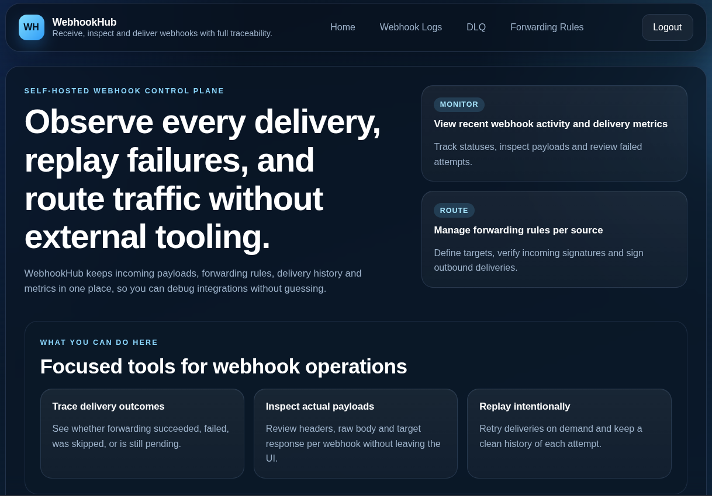

# WebhookHub

📬 **WebhookHub** is a lightweight, self-hosted service for receiving, logging, and forwarding webhooks.

Use it to debug, inspect, replay, and route incoming webhooks during development or in production. No third-party services, no cloud lock-in — just full control.



---

## 🚀 Why WebhookHub?

When working with external services (Stripe, GitHub, Telegram, Shopify, etc.), developers often face the same pain points:

- ❓ *Where did the webhook go? Why didn’t my service receive it?*
- 🔁 *How do I replay a webhook for debugging or recovery?*
- 🔍 *How do I inspect payloads and headers easily?*
- 📡 *How can I fan-out one webhook to multiple services?*

WebhookHub provides a simple, developer-friendly solution to these problems.

---

## ✨ Core Features (MVP)

- ✅ Receive webhooks at `/hook/:source`
- ✅ Log full payloads, headers, timestamps
- ✅ Replay any webhook via Web UI
- ✅ Forwarding rule per source
- ✅ Optional incoming/outgoing HMAC signing (Stripe-style header format)
- ✅ Web dashboard with filters, pagination
- ✅ Secure login (admin account)
- ✅ Postgres + GORM backend
- ✅ Dockerized and ready to deploy

---

## 📌 Roadmap

### MVP - v0.1
- [x] Accept and log webhooks
- [x] View logs with filters and pagination
- [x] Replay webhooks on demand
- [x] Add/edit/delete forwarding rules
- [x] Delete individual webhook logs
- [x] Admin auth (session cookie + bcrypt)
- [x] PostgreSQL + GORM backend
- [x] Docker + compose setup

### v0.2+
- [x] HMAC signature verification (e.g., Stripe-style)
- [x] Delivery status tracking + metrics
- [x] Dead-letter queue
- [x] Configurable retry/backoff policy
- [x] Dead-letter queue management UI

### v0.3+
- [x] Advanced search and filters
- [x] Retention / cleanup policies

### v0.3.1 - Production baseline
- [x] Explicit database error handling
- [x] Recovery of interrupted deliveries with database leases
- [x] Bounded delivery worker pool and graceful shutdown
- [x] Request body limits and source/target validation
- [x] Required secure configuration with fail-fast validation
- [x] HTTP method restrictions and CSRF protection
- [x] Liveness and readiness endpoints
- [x] CI and critical unit/integration tests

### v0.3.2+
- [ ] Export and bulk redelivery tools
- [ ] Telegram integration
- [ ] OpenAPI schema

### v0.4+
- [ ] Plugin system for custom processors

---

## 🛠️ Tech Stack

| Component     | Technology        |
|---------------|-------------------|
| Language      | Go                |
| Database      | PostgreSQL (via GORM) |
| UI            | HTML + HTMX       |
| Auth          | SecureCookie + bcrypt |
| Container     | Docker + Compose  |

---

## 📦 Getting Started

```bash
git clone https://github.com/Paramoshka/WebhookHub.git
cd webhookhub
cp .env.sample .env
# Fill every required value in .env before starting the service.
docker-compose up -d --build
```

### 🔐 Generate Session Key

WebhookHub uses a 32-byte secret key to sign session cookies.  
You must set this in your `.env` file as `SESSION_KEY`.

To generate a secure random key:

```bash
openssl rand -hex 32
```

## ⚙️ Configuration

WebhookHub validates configuration at startup and exits if a required value is missing or unsafe.

Required values:

- `ADMIN_EMAIL`
- `ADMIN_PASSWORD` — at least 12 characters
- `SESSION_KEY` — at least 32 characters; generate it with `openssl rand -hex 32`
- `POSTGRES_HOST`, `POSTGRES_PORT`, `POSTGRES_USER`, `POSTGRES_PASSWORD`, `POSTGRES_DB`

Production deployments behind HTTPS should set `COOKIE_SECURE=true`. PostgreSQL TLS can be configured with `POSTGRES_SSLMODE` (default: `disable`).
Failed logins are limited to 10 attempts per 15 minutes per client address. Enable `TRUST_PROXY_HEADERS=true` only behind a reverse proxy you control: it makes the limiter use the first `X-Forwarded-For` address, which clients can otherwise spoof.
`ADMIN_EMAIL` and `ADMIN_PASSWORD` are authoritative bootstrap credentials: on startup WebhookHub creates the single admin or updates that account to match the configured values.

Runtime limits and delivery workers:

```dotenv
PORT=8080
MAX_BODY_BYTES=1048576
DELIVERY_WORKERS=4
DELIVERY_POLL_INTERVAL=1s
DELIVERY_LEASE_DURATION=30s
DELIVERY_TIMEOUT=5s
SHUTDOWN_TIMEOUT=10s
```

`DELIVERY_TIMEOUT` is the deadline for a single delivery attempt and must be shorter than `DELIVERY_LEASE_DURATION`, otherwise another worker could claim the webhook while the attempt is still running.

Delivery is at-least-once. A database lease lets another worker recover a webhook left in `processing` after a crash. A duplicate remains possible if the target accepted a request but WebhookHub stopped before persisting the result.
Replay and delete requests for a webhook currently in `processing` are rejected with HTTP `409 Conflict` so an active delivery cannot be changed underneath a worker.

Health endpoints:

- `GET /healthz` reports that the process is running.
- `GET /readyz` reports readiness only when PostgreSQL responds.
- The container healthcheck runs `webhookhub healthcheck`, which checks `/readyz` without requiring shell utilities in the image.

### Inspect a webhook

Open **Inspect** from the logs, DLQ, or metrics to view `/webhooks/{id}`. The page
shows request headers, JSON with Formatted/Raw views, copy controls, and delivery
history. Status, attempts, and the latest saved response refresh every five
seconds without replacing the request payload. Replay queues a new delivery;
it does not mean the receiver has accepted the webhook yet.

Open an attempt ID to inspect its saved response headers and body. Each new
attempt keeps its own response, including across Replay. Bodies are limited to
1 MiB and the page indicates truncation; partial bodies are retained when reading
fails. Older attempts explicitly show that no response was saved. Attempt
responses are removed with their webhook by deletion or retention cleanup.

Forwarding and Replay preserve the received `Content-Type`, including charset
and multipart boundary parameters. If the incoming request omitted this header,
the forwarded request also omits it. Legacy records with no stored headers keep
the previous `application/json` default. Other incoming headers are not copied;
outgoing HMAC signatures are generated using the configured outgoing secret.

**Download payload** (`GET /webhooks/{id}/payload`, login required) saves the exact
stored bytes. Binary bodies show a hex preview of up to 256 bytes. Clipboard
access depends on browser permissions and a secure context (HTTPS or localhost);
if copying is unavailable, the page provides a manual-copy message. Existing
`/partials/webhook/{id}` links continue to open the full detail page.

### Retention cleanup

Retention cleanup is optional and disabled by default. Configure via `.env`:

```dotenv
# Retention cleanup
RETENTION_ENABLED=false
RETENTION_DAYS=30
RETENTION_INTERVAL=24h
RETENTION_BATCH_SIZE=300
```

When enabled, expired webhooks are removed in batches every interval by `received_at`.
Active deliveries and queued retries are retained. Cleanup locks each batch before
deleting it: a webhook successfully requeued first is retained; replay returns
`404` if cleanup deleted the webhook first.

### Advanced logs filters (UI and API)

`/dashboard` includes advanced filters in the UI and the same parameters are available via:

`GET /partials/webhooks`

Query params:

- `source`: exact match on webhook source.
- `status`: exact match on status (`pending`, `processing`, `retrying`, `success`, `failed`, `skipped`, `dead_lettered`).
- `q`: full-text search across `source`, payload, headers, last error, and DLQ reason.
- `from`: inclusive lower bound for `received_at` (supports `RFC3339`, `RFC3339Nano`, `2006-01-02T15:04`, `2006-01-02`).
- `to`: exclusive upper bound for `received_at` (same formats; a date-only value includes that entire UTC day by using the start of the following day as the bound).
- `sort`: one of `id_desc` (default), `received_desc`, `received_asc`, `id_asc`.
- `page`: page number (default `1`), 10 items per page.

The **From (UTC)** and **To (UTC)** controls display UTC. Values without an offset
are interpreted as UTC, independent of the server timezone; RFC3339 values with
an explicit offset keep their original instant and are displayed in UTC. This
also applies to DLQ query parameters. On upgrade, existing filter URLs without
an offset change from server-local time to UTC; add an explicit offset to retain
their previous meaning if your server used another timezone.

Automatic refresh preserves the current page and applied filters. Apply and Reset
start at page 1; Reset clears the filters.

Applying filters and changing pages updates the `/dashboard` URL. Reloading,
opening a shared URL, and browser Back/Forward restore the selected filters and
page. Inspect links from logs and DLQ retain a return link to that result set,
including after Replay. Background refresh does not add browser history entries.

**Pause updates** pauses background refresh for logs and metrics. Filters,
pagination, and actions still work while paused; **Resume updates** fetches fresh
data immediately. Each section shows its last successful refresh time and reports
refresh failures while retaining the displayed data. Retry/Delete report progress
and errors and prevent repeated clicks while an action is running. Action results
refresh the view once even while background updates are paused.

Payload search is case-insensitive text matching over UTF-8 content, including
existing events. Binary payloads and bodies containing zero bytes are excluded
from payload text matching, but remain searchable by their other fields and are
stored and forwarded unchanged. Startup creates or replaces the PostgreSQL
function `webhookhub_payload_text(bytea)`; the database user must have permission
to create functions in the application's schema and own the function on upgrades.

Example:

```bash
curl "http://localhost:8080/partials/webhooks?source=stripe&status=failed&q=payment&from=2026-07-01&to=2026-07-11T23:59&sort=received_desc&page=2"
```

## 📄 License

Copyright (C) 2025-2026 Ivan Parfenov.

WebhookHub is available under two licensing options:

1. **Open-source license:** [GNU AGPL v3 only](LICENSE). You may use, modify,
   distribute, and operate WebhookHub commercially under the AGPL. If you
   modify it and users interact with your version over a network, section 13
   requires you to prominently offer those users the corresponding source code
   at no charge.
2. **Commercial license:** alternative terms are available for users that want
   to keep their modifications closed or cannot comply with the
   AGPL. Contact
   [ivan.parfenov.42a@gmail.com](mailto:ivan.parfenov.42a@gmail.com).

Commercial use does not by itself require a commercial license. Third-party
dependencies remain subject to their own licenses.

Contributions are accepted under the [Contributor License Agreement](CLA.md)
and the process described in [CONTRIBUTING.md](CONTRIBUTING.md).
